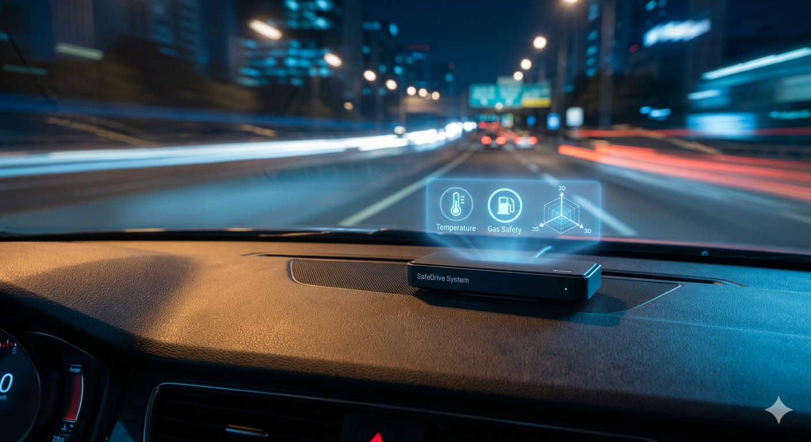
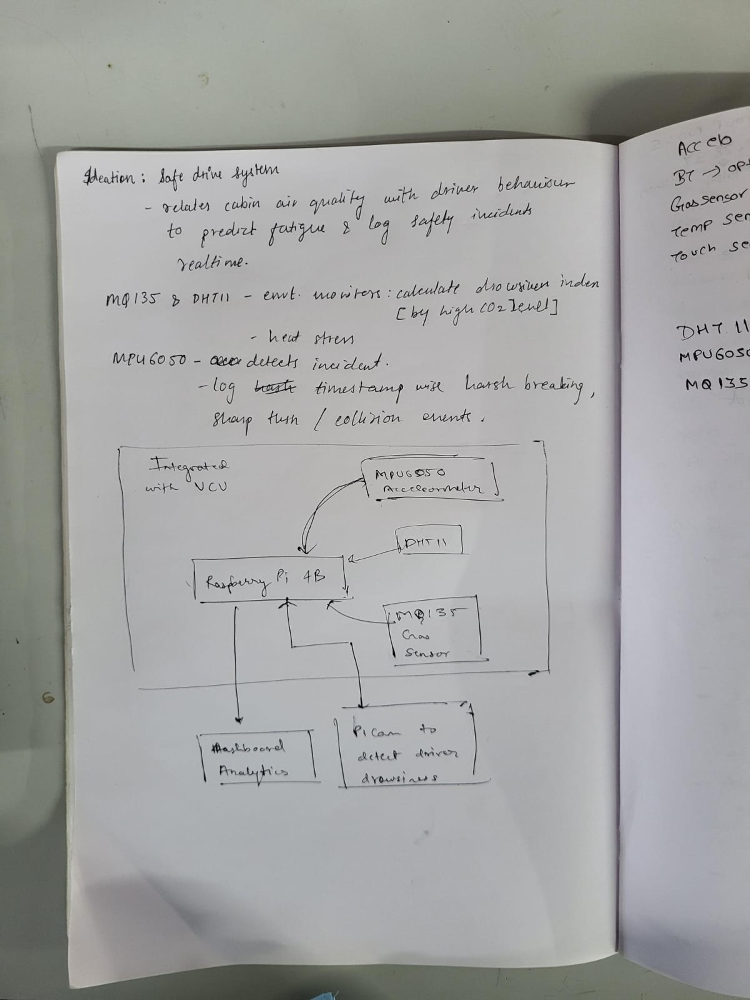
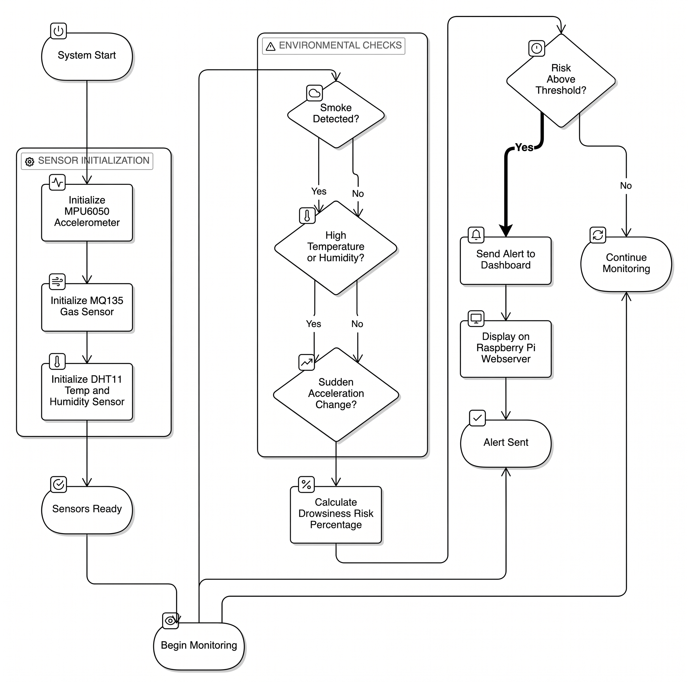
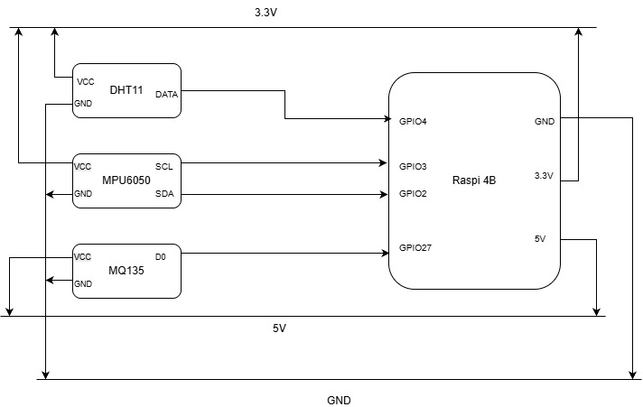
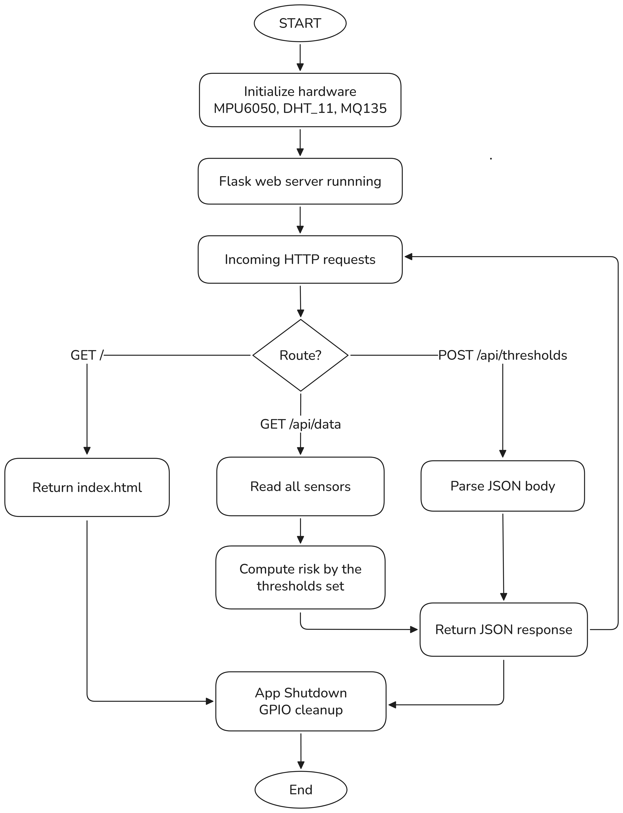
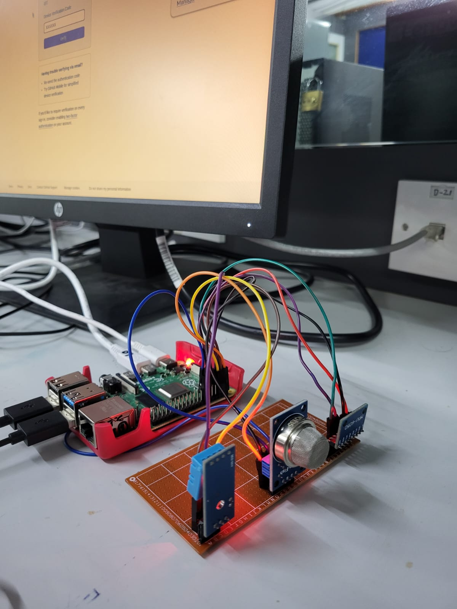

# SKILL LAB PRACTICAL HACKATHON

## Final Project README

> **Project Weight:** 100%
> **Team Size:** 4 students
> **Project Duration:** 16 hours
> **Total Time Available:** 32 effort-hours per team
> **Project Type:** Sensor-based, edge-computing safety system

---

# Before you begin

## Fork and rename this repository

After forking this repository, rename it using the format:

`SKILLLAB_PROR-2026-TeamName`

### Example

`SKILLLAB_PROR-2026-SENTRI`

Do not keep the default repository name.

---

# How to use this README

This file is your team's **working project document**.

You must keep updating it throughout the build period.
By the final review, this README should clearly show:

- your idea,
- your planning,
- your design decisions,
- your technical process,
- your build progress,
- your testing,
- your failures and changes,
- your final outcome.

## Rules

- Fill every section.
- Do not delete headings.
- If something does not apply, write `Not applicable` and explain why.
- Add images, screenshots, sketches, links, and videos wherever useful.
- Update task status and weekly logs regularly.
- Use this file as evidence of process, not only as a final report.

---

# 1. Team Identity

## 1.1 **SENTRI**

## 1.2 Team Members

| Name                  | Primary Role                  | Secondary Role    | Strengths Brought to the Project         |
| --------------------- | ----------------------------- | ----------------- | ---------------------------------------- |
| Hrishikesh Pandit     | Documentation                        | Coding     | Documentation, Software Architecture    |
| Soham Pednekar        | Coding      | Documentation           | Frontend Devlopment              |
| Shaunak Karambelkar   | Coding     | Hardware            | Management & Execution            |
| Muskan Jaiswal        | Hardware     | Coding            | Material Handling, Hardware, Operations              |

## 1.3 **SafeDrive System**

## 1.4 One-Line Pitch

SafeDrive System is an edge-computing safety node that fuses real-time cabin air quality and vehicle dynamics to instantly alert drivers of drowsiness risks or dangerous driving behaviors before accidents happen.

## 1.5 Expanded Project Idea

SafeDrive System is an edge-computing active safety monitor designed for vehicles that correlates environmental stressors with kinetic data to prevent accidents. For the driver and passengers, it creates a seamless, preventative safety experience by providing instant, real-time interventions. Instead of passively recording data, the system actively tracks cabin life-support conditions and immediately alerts the driver to severe CO₂ buildup or extreme heat that causes drowsiness, while simultaneously warning them of erratic driving behaviors like harsh braking or sudden impacts.

Technologically, the project is powered by a Raspberry Pi 4B acting as a local edge-processing hub to fuse multi-sensor data without requiring a cloud connection. The hardware stack integrates an MQ135 air quality sensor (interfaced safely to the Pi via a custom 10kΩ/20kΩ hardware voltage divider) and a DHT11 sensor for environmental monitoring, paired with an I2C-based MPU6050 6-DOF accelerometer for kinetic tracking. The system's logic is driven by Python and the Adafruit CircuitPython ecosystem, allowing the node to execute complex safety algorithms and trigger visual alerts in milliseconds.

---

# 2. Inspiration

## 2.1 References

| Source Type | Title / Link | What Inspired You |
| :--- | :--- | :--- |
| Research Paper | [Real-Time Machine Learning-Based Driver Drowsiness Detection Using Visual Features](https://www.mdpi.com/2313-433X/9/5/91) | Inspired by research on real-time drowsiness detection, we aimed to build a preventative system that monitors the atmospheric and kinetic root causes of fatigue—such as CO₂ buildup and heat—rather than just the visual symptoms. |
| Scientific Study | [Elevated Indoor Carbon Dioxide Impairs Decision-Making Performance](https://ehp.niehs.nih.gov/doi/10.1289/ehp.1104789) | Validated the core hypothesis of this project: even moderate CO₂ buildup directly causes cognitive decline and delayed reaction times, proving the need for a preventative cabin air monitor. |
| Hardware Guide | [Adafruit MPU6050 6-DoF Accelerometer and Gyro Setup](https://learn.adafruit.com/mpu6050-6-dof-accelerometer-and-gyro) | Taught us how to capture and parse raw kinetic data over I2C, which inspired the "Harsh Braking" and physical impact detection mechanics using dynamic G-force thresholds. |
| Engineering Tutorial | [SparkFun: Voltage Dividers and Logic Level Shifting](https://learn.sparkfun.com/tutorials/voltage-dividers/all) | Inspired the lean hardware engineering approach of building a custom 10kΩ/20kΩ voltage divider to safely bridge the 5V MQ135 sensor to the 3.3V Raspberry Pi without relying on pre-built modules. |
| Software Docs | [Adafruit Blinka (CircuitPython for Raspberry Pi)](https://learn.adafruit.com/circuitpython-on-raspberrypi-linux/installing-circuitpython-on-raspberry-pi) | Provided the framework for our "Edge Computing" software architecture, showing how to rapidly fuse I2C sensor data and GPIO digital inputs into a single, zero-latency Python loop. |

## 2.2 Original Twist

While traditional vehicle safety systems (like OBD-II scanners or dashcams) are purely reactive — recording data after a mechanical failure or crash has already occurred — SafeDrive System is completely **predictive and proactive**.

Our originality lies in shifting the focus from the machine's health to the **driver's physiological state**, using a lean edge-computing architecture.

Here is what sets this project apart:

1. **Multi-Domain Sensor Fusion:** We bridge two completely different domains of data. By combining Environmental Life-Support metrics (gas/air quality and temperature) with Kinetic Physics (G-force and acceleration), the system doesn't just know how the car is moving — it understands the conditions causing the driver to move that way.

2. **Predictive Fatigue Modeling:** Instead of using complex, expensive computer vision cameras to check if a driver's eyes are closing, we tackle the root cause of drowsiness. By monitoring CO₂ buildup and heat stress, the system warns the driver to ventilate the cabin before cognitive decline and microsleeps occur.

3. **100% Edge-Processed & Zero Latency:** In a life-safety application, milliseconds matter. By keeping all data processing strictly local on the Raspberry Pi 4B, we eliminated the need for cloud computing, Wi-Fi dependency, or database logging. The system provides instantaneous visual interventions with zero network latency.

4. **Scalable, Low-Overhead Architecture:** Instead of relying on expensive, proprietary automotive diagnostic tools, we utilized accessible components integrated via custom signal-conditioning circuits. This proves the system can be mass-deployed across an entire commercial fleet at a fraction of the cost of traditional telematics, democratizing vehicle safety.

---

# 3. Project Intent

## 3.1 User Journey

Imagine **Ashutosh**, a driver embarking on a long evening commute after a tiring workday. As Ashutosh starts the car, the SafeDrive System — discreetly mounted on the dashboard — silently springs to life, its sensors immediately beginning to scan the cabin's "vitals."

Halfway through the journey, the car windows are rolled up against the cold air, and the heater is humming. Ashutosh doesn't notice that CO₂ levels are steadily rising and the cabin temperature has hit a stuffy 28°C. His eyes begin to feel heavy, a classic sign of early-stage drowsiness.

Before Ashutosh even realizes he is at risk, the system's edge-processor correlates the air quality spike with the rising heat. Suddenly, a bright **"DANGER: VENTILATE CABIN"** alert flashes on the dashboard interface. Startled back into focus, Ashutosh rolls down the window, breathes in the fresh air, and feels instantly more alert.

A few miles later, a distracted driver suddenly cuts into Ashutosh's lane. Ashutosh reacts quickly, slamming on the brakes. The MPU6050 sensor detects the violent deceleration and the sudden spike in G-force. Even before the car has come to a complete halt, the system displays a **"CRITICAL: HARSH BRAKING DETECTED"** alert. This immediate feedback serves as a digital co-pilot, helping Ashutosh remain aware of his driving dynamics and the cabin environment. He reaches his destination safely, guided by a system that watched for the dangers he couldn't see.

---

# 4. Definition of Success

## 4.1 Definition of "Usable"

A "usable" version of SafeDrive System is defined by its ability to operate as a passive, non-distracting co-pilot that provides high-confidence alerts. To meet this standard, the system must achieve:

- **Glanceable UI:** The output must be visible and legible (user friendly) to the user.
- **Zero-Latency Intervention:** The time between a sensor detecting a threshold breach (like a sudden 2G impact or a gas spike) and the visual alert appearing must be less than 200ms.
- **Zero-Touch Operation:** Once the vehicle starts, the system must initialize and begin monitoring automatically without requiring any manual calibration or user input.

## 4.2 Minimum Usable Version

The Minimum Usable Version (MUP) is the smallest functional iteration that demonstrates "Multi-Domain Sensor Fusion." This includes:

- **Core Hardware:** Raspberry Pi 4B integrated with the MQ135 (via voltage divider), DHT11 and MPU6050.
- **Primary Logic:** A single Python script that reads the Digital Output of the gas sensor, temperature sensor and the Acceleration Magnitude of the MPU6050.
- **Basic Alert System:** A terminal-based or simple HTML dashboard that toggles between "Safe" and "Warning" based on those three inputs.
- **Power Stability:** The system must be able to run off a standard 5V USB car charger/power bank without crashing.

## 4.3 Stretch Features

- **Auditory Alarms:** Integration of a piezo buzzer to provide distinct "beep" patterns for different threats (e.g., a long tone for toxic air, rapid pulses for harsh braking).
- **Night Mode UI:** An interface that automatically dims or switches to red-light tones during night-time driving to preserve the driver's night vision.
- **Cloud-Sync Dashboard:** A secondary Flask-based web interface allowing a passenger or remote fleet manager to view the vehicle's "vitals" over a local Wi-Fi or 4G hotspot.
- **Historical Incident Snapshots:** Capturing a 5-second "data snapshot" of all sensor values leading up to a harsh braking event to help the driver review their behavior later.

---

# 5. System Overview

## 5.1 Project Type

- [x] Electronics-based
- [ ] Mechanical
- [x] Sensor-based
- [ ] App-connected
- [x] Motorized
- [ ] Sound-based
- [ ] Light-based
- [ ] Screen/UI-based
- [ ] Fabricated structure
- [ ] Game logic based
- [x] Installation
- [ ] Other

## 5.2 High-Level System Description

The SafeDrive System functions as an intelligent co-pilot that monitors the "health" of the vehicle's interior environment and the safety of its movement.

- **Input:** The system continuously gathers data from three specialized sensors: the MQ135 (detecting CO₂, smoke, and alcohol vapors), the DHT11 (measuring cabin temperature and humidity), and the MPU6050 (tracking G-forces and sudden impacts).

- **Processing:** All data is fed into a Raspberry Pi 4B. The Pi runs a Python-based processing engine that uses threshold-based logic to treat the vehicle's safety like a status bar. It filters noise, compensates for environmental shifts, and determines if current conditions cross safety thresholds.

- **Output:** The system provides immediate feedback through a screen/UI-based dashboard.

- **Physical Structure:** Components are housed in a fabricated enclosure designed to be mounted on a standard vehicle dashboard, ensuring sensors are positioned for optimal airflow and movement detection.

- **Web Interface:** The system hosts a local web server, allowing passengers or drivers to view a real-time dashboard on their mobile devices via Wi-Fi to monitor cabin "vitals" and history.

## 5.3 Input / Output Map

| System Part               | Type       | What It Does                                                              |
| :------------------------ | :--------- | :------------------------------------------------------------------------ |
| MQ135 Gas Sensor          | Input      | Detects CO₂ levels and toxic vapors to identify air quality risks.        |
| MPU6050 Accelerometer     | Input      | Measures kinetic forces to detect harsh braking or physical impacts.      |
| DHT11 Sensor              | Input      | Monitors cabin temperature to prevent heat-related driver fatigue.        |
| Raspberry Pi 4B           | Processor  | The central brain that fuses sensor data and executes safety logic.       |
| Web Dashboard / LCD       | Output     | Displays real-time safety status and color-coded warnings (Green/Red).    |

---

# 6. System Design, Sketches and Visual Planning

## 6.1 Concept Architecture / Sketch / Schematic

## 6.2 Labeled Build Sketch / Architecture / Flow Diagram / Algorithm

## 6.3 Approximate Dimensions

| Dimension        | Value  |
| ---------------- | ------ |
| Length           | 16 cm  |
| Width            | 16 cm  |
| Height           | 8 cm   |
| Estimated Weight | 400 g  |

---

# 7. Electronics Planning

## 7.1 Electronics Used

| Component              | Quantity | Purpose                                              |
| ---------------------- | -------: | ---------------------------------------------------- |
| Raspberry Pi 4B        | 1        | Main edge-computing controller                       |
| MQ135 Gas Sensor       | 1        | Detect CO₂, alcohol vapors, and toxic gases          |
| DHT11 Sensor           | 1        | Monitor cabin temperature and humidity               |
| MPU6050 Accelerometer  | 1        | Detect G-forces, harsh braking, and sudden impacts   |
| 10kΩ Resistor          | 1        | Voltage divider (upper leg) for MQ135 analog output  |
| 20kΩ Resistor          | 1        | Voltage divider (lower leg) for safe Pi GPIO input   |

## 7.2 Wiring Plan

The **Raspberry Pi 4B** is the central hub for all connections:

- **MQ135 Gas Sensor:** The analog output of the MQ135 is stepped down from 5V to ~3.3V using a custom resistor voltage divider (10kΩ upper, 20kΩ lower) before connecting to a GPIO pin. The digital output (DO) pin connects directly to a GPIO input pin.
- **DHT11 Sensor:** Data pin connects directly to a GPIO pin (e.g., GPIO4). Powered from the Pi's 3.3V rail.
- **MPU6050:** Connected via I2C bus — SDA to GPIO2 (Pin 3), SCL to GPIO3 (Pin 5). Powered from the 3.3V rail.
- **LED Indicators:** Each LED connects through a 220Ω current-limiting resistor to individual GPIO output pins.
- **Haptic Motor / Fan:** Driven via a transistor (NPN BJT) or small MOSFET to avoid overcurrenting the GPIO pins, controlled by a PWM-capable GPIO output.

All components share a **common ground** with the Raspberry Pi for stable operation.

## 7.3 Circuit Diagram

## 7.4 Power Plan

| Question         | Response                                                                                                                                                   |
| ---------------- | ---------------------------------------------------------------------------------------------------------------------------------------------------------- |
| Power source     | Standard 5V USB power bank or vehicle USB car charger                                                                                                      |
| Voltage required | 5V for Raspberry Pi 4B; 3.3V for sensors (regulated by Pi's onboard regulator); 5V rail for MQ135 heater                                                  |
| Current concerns | MQ135 heater draws ~150mA; MPU6050 draws ~3.9mA; total system draw ~800mA–1A. Power bank must supply ≥2A to ensure stability.                             |
| Safety concerns  | Voltage divider is critical — connecting MQ135 analog output directly to Pi GPIO (3.3V max) without it will damage the Pi. All wiring secured in enclosure. |

---

# 8. Software Planning

## 8.1 Software Tools

| Tool / Platform          | Purpose                                                        |
| ------------------------ | -------------------------------------------------------------- |
| Python 3                 | Main application logic and sensor data processing              |
| Adafruit CircuitPython   | Sensor libraries (DHT11, MPU6050, MQ135 GPIO)                  |
| Flask                    | Local web server for real-time dashboard UI                    |
| HTML / CSS / JavaScript  | Front-end dashboard with color-coded status display            |
| RPi.GPIO / gpiozero      | GPIO control for LEDs and haptic motor output                  |

## 8.2 Software Logic / Algorithm

- **Startup Behavior:**
  The Python script initializes all sensor libraries and GPIO pins on boot (via `systemd` service or `rc.local`). It verifies sensor connectivity over I2C and GPIO. If a sensor fails to initialize, it logs a warning and continues with remaining sensors.

- **Input Handling:**
  The main loop polls all three sensors at a configurable interval (default: 500ms). DHT11 and MQ135 readings are averaged over a rolling window to reduce noise.

- **Sensor Reading:**
  - MQ135 digital output (HIGH = gas threshold exceeded) and analog voltage (via voltage divider) are read each cycle.
  - DHT11 returns temperature (°C) and humidity (%).
  - MPU6050 returns X, Y, Z acceleration values; acceleration magnitude `|a| = √(ax² + ay² + az²)` is computed each cycle.

- **Decision Logic:**
  Thresholds are applied:
  - CO₂ / Gas: MQ135 DO = HIGH → Warning; analog voltage above secondary threshold → Critical.
  - Temperature: >27°C → Warning; >32°C → Critical.
  - G-Force magnitude: >1.5G → Harsh braking / impact alert.
  - Combined: CO₂ Warning + Temperature Warning simultaneously → "VENTILATE CABIN" alert.

- **Output Behavior:**
  - Green LED on: All safe.
  - Yellow LED on: One parameter in Warning range.
  - Red LED on + haptic pulse: Critical threshold breached. Alert displayed on dashboard.
  - Flask dashboard updates via WebSocket or polling at 1Hz.

- **Communication Logic:**
  Flask serves a local web page on port 5000. Any device on the same Wi-Fi network can view the live dashboard.

- **Reset Behavior:**
  Alerts auto-clear if sensor readings return below thresholds for a sustained 5-second window. No manual reset required.

## 8.3 Code Flowchart

---

# 9. Bill of Materials

## 9.1 Full BOM

| Item                        | Quantity | In Kit? | Need to Buy? | Estimated Cost (₹) | Material / Spec                     | Why This Choice?                                         |
| --------------------------- | -------: | ------- | ------------ | ------------------: | ----------------------------------- | -------------------------------------------------------- |
| Raspberry Pi 4B             | 1        | Yes     | No           | 0                   | 4GB RAM, 40-pin GPIO                | Edge processing hub; runs Python, Flask, I2C             |
| MQ135 Gas Sensor Module     | 1        | No      | Yes          | 120                 | Analog + Digital output, 5V        | Detects CO₂, alcohol, smoke — key drowsiness indicator   |
| DHT11 Sensor                | 1        | No      | Yes          | 60                  | 3.3V/5V, single-wire               | Temperature and humidity for heat-fatigue correlation    |
| MPU6050 Accelerometer (I2C) | 1        | No      | Yes          | 100                 | 6-DOF, I2C, 3.3V                   | Detects G-force for harsh braking / impact detection     |
| 10kΩ Resistor               | 1        | Yes     | No           | 0                   | 1/4W                               | Voltage divider upper leg (MQ135 → Pi GPIO protection)   |
| 20kΩ Resistor               | 1        | Yes     | No           | 0                   | 1/4W                               | Voltage divider lower leg                                |               |
| Jumper Wires + Breadboard   | 1 set    | Yes     | No           | 0                   | Male-female, male-male             | Prototyping connections                                  |                 |

## 9.2 Material Justification

The **Raspberry Pi 4B** was chosen over microcontrollers like ESP32 because the system requires simultaneous I2C communication, floating-point math for acceleration magnitude, a Python web server (Flask), and GPIO control — tasks that benefit from a full Linux OS.

The **MQ135** was selected over more expensive CO₂ sensors because it provides a reliable digital threshold output ideal for binary "safe/unsafe" alerting without requiring complex ADC calibration. The voltage divider is a low-cost, safe solution to interface its 5V analog output with the Pi's 3.3V-tolerant GPIO.

The **MPU6050** was chosen for its mature I2C library support in Python and its ability to provide 6-DOF data needed to differentiate harsh braking (longitudinal G) from bumpy roads (vertical Z-axis noise).

## 9.3 Items to Procure

| Item                    | Why Needed                              | Purchase Link  | Latest Safe Date to Procure | Status    |
| ----------------------- | --------------------------------------- | -------------- | --------------------------- | --------- |
| MQ135 Gas Sensor        | Core air quality detection              | robu.in        | Before Day 1 build          | Received  |
| DHT11 Sensor            | Cabin temperature monitoring            | robu.in        | Before Day 1 build          | Received  |
| MPU6050 Accelerometer   | Kinetic / G-force detection             | robu.in        | Before Day 1 build          | Received  |

## 9.4 Budget Summary

| Budget Item           | Estimated Cost (₹) |
| --------------------- | ------------------: |
| DHT11 |     45             |
| MPU6050  | 150                  |
| MQ135 | 95                 |
| **Total**             | **280**             |

## 9.5 Budget Reflection

The project is designed to be low-cost by reusing the Raspberry Pi 4B and passive components already available in the kit. If budget pressure increases, the DHT11 can be removed and temperature monitoring deprioritized, focusing the MVP on MQ135 + MPU6050 fusion only. The enclosure can be simplified to cardboard if laser cutting is unavailable.

---

# 10. Planning the Work

## 10.1 Team Working Agreement

- **Task Division:** Tasks are divided by domain — Hrishikesh and Soham managed the Documentation. Muskan and Shaunak handeled the coding andhardware implementation.
- **Decision Making:** Simple majority for minor decisions; full consensus required for major pivots (e.g., dropping a sensor or changing architecture).
- **Progress Checks:** 15-minute sync at the start of each 2-hour block to review task status and blockers.
- **Delayed Tasks:** If a task is delayed, the owner flags it immediately so the team can re-prioritize. Documentation is updated to reflect the change.
- **Documentation:** Hrishikesh maintains the README in real time. All team members add notes, photos, and test results as they occur.

## 10.2 Task Breakdown

| Task ID | Task                                       | Owner              | Estimated Hours | Deadline       | Dependency | Status      |
| ------- | ------------------------------------------ | ------------------ | --------------: | -------------- | ---------- | ----------- |
| T1      | Finalize concept and sensor selection      | All                | 1               | Hour 1         | None       | Done        |
| T2      | Complete BOM and identify purchases        | Hrishikesh         | 0.5             | Hour 1         | T1         | Done        |
| T3      | MPU6050 (I2C) + test        | Shaunak              | 1.5             | Hour 3         | T1         | Done        |
| T4      | Wire DHT11 + MQ135 + test          | Muskan            | 1.5             | Hour 3         | T1         | Done        |
| T5      | Write sensor reading Python scripts        | Muskan,Shaunak,Soham         | 2               | Hour 4         | T3, T4     | Done        |
| T6      | Write threshold/alert decision logic       | Soham        | 1.5             | Hour 5         | T5         | Done        |
| T7      | Build Flask dashboard UI                   | Soham         | 2               | Hour 6         | T6         | Done        |
| T8      | Integration of all 3 sensors         | Shaunak            | 1               | Hour 4         | T3         | Done        |
| T9      | Assemble on dot board           | Muskan     | 2               | Hour 6         | T3, T4     | Done        |
| T10     | System integration test                   | All                | 1.5             | Hour 7         | T7, T8, T9 | Done        |
| T11     | Playtesting, bug fixes, UI polish          | All                | 1.5             | Hour 8         | T10        | Done        |
| T12     | Final documentation and README update      | Hrishikesh         | 1               | End of Day     | T11        | Done        |

## 10.3 Responsibility Split

| Area               | Main Owner          | Support Owner        |
| ------------------ | ------------------- | -------------------- |
| Concept            | All                 | -                    |
| Electronics        | Muskan, Shaunak      | Soham, Hrishikesh               |
| Coding             | Soham, Muskan, Shaunak          | Hrishikesh                |
| Mechanical Build   | Shaunak, Muskan     | Soham, Hrishikesh                |
| Testing            | All                 | —                    |
| Documentation      | Hrishikesh          | All                  |

---

# 11. Hour Milestones

## 11.1 8-Hour Plan

### Bi-Hour 1 — Plan and De-risk

Expected outcomes:

- [x] Idea finalized
- [x] Core interaction decided
- [ ] Sketches made
- [x] BOM completed
- [x] Purchase needs identified
- [x] Key uncertainty identified (MQ135 voltage divider calibration)
- [x] Basic feasibility tested

### Bi-Hour 2 — Build Subsystems

Expected outcomes:

- [x] Electronics tests completed
- [x] Enclosure planning completed
- [ ] Flask UI started
- [x] Sensor wiring tested individually
- [x] Main subsystems partially working

### Bi-Hour 3 — Integrate

Expected outcomes:

- [ ] Physical enclosure built(NA)
- [ ] Electronics integrated into enclosure(NA)
- [x] Code connected to hardware
- [x] Sketches made
- [ ] Flask dashboard live on local network
- [x] First fully functional version exists

### Bi-Hour 4 — Refine and Finish

Expected outcomes:

- [x] Technical bugs reduced
- [x] Playtesting completed
- [x] Improvements made
- [x] Flask dashboard live on local network
- [x] Documentation completed
- [x] Final build ready

# 12 Update Log

| Day    | Planned Goal                                | What Actually Happened                                         | What Changed                                         | Next Steps                              |
| ------ | ------------------------------------------- | -------------------------------------------------------------- | ---------------------------------------------------- | --------------------------------------- |
| Day 1  | Complete Sensor Integration + Flask Dashboard     | Individual Sensor calibration and testing + Building UI interface + Integrate all sensors into single script + Testing       | Minor GPIO pin conflict resolved  | Documentation
| Day 2  | Documentation         | All logs reviewed | Git was updated | Final Submission        |
| Day 3  | Submission | Presentation and explanation of Project        |  -  |  -
| Day 4  | -    | - | —                                                    | -                        |

---

# 13. Risks and Unknowns

## 13.1 Risk Register

| Risk                                                              | Type        | Likelihood | Impact | Mitigation Plan                                                                                         | Owner       |
| ----------------------------------------------------------------- | ----------- | ---------- | ------ | ------------------------------------------------------------------------------------------------------- | ----------- |
| MQ135 analog output exceeds 3.3V and damages Pi GPIO             | Technical   | High       | High   | Use 10kΩ/20kΩ voltage divider; verify with multimeter before connecting to Pi                           | Shaunak       |
| MPU6050 I2C address conflict with other devices                   | Technical   | Low        | Medium | Confirm I2C address (0x68) with `i2cdetect`; no other I2C devices on bus                                | Shaunak  |
| DHT11 occasional read failures (known library issue)              | Technical   | Medium     | Low    | Wrap reads in try/except; use last valid reading on failure                                              | Hrishikesh  |
| Flask dashboard inaccessible if Pi IP changes                     | Technical   | Low        | Medium | Set static IP on Pi's Wi-Fi interface or use mDNS (`raspberrypi.local`)                                  | Soham  |

## 13.2 Biggest Unknown Right Now

The biggest uncertainty is **MQ135 calibration accuracy** in a real vehicle cabin environment. The MQ135 has a warm-up period (~24 hours for full accuracy), and its digital threshold is set by an onboard potentiometer. In the hackathon timeframe, we cannot fully calibrate for real CO₂ ppm values — so we are relying on the **relative change in analog voltage** and the **digital threshold trigger** as a proxy for dangerous air quality, rather than an absolute ppm reading.

---

# 14. Testing

## 14.1 Technical Testing Plan

| What Needs Testing              | How You Will Test It                                                                          | Success Condition                                                              |
| ------------------------------- | --------------------------------------------------------------------------------------------- | ------------------------------------------------------------------------------ |
| MQ135 voltage divider output    | Measure voltage at Pi GPIO pin with multimeter while MQ135 is powered                        | Voltage reads ≤ 3.3V under all conditions                                     |
| DHT11 temperature reading       | Place sensor in known-temperature environment; compare with reference thermometer             | Reading within ±2°C of reference                                               |
| MPU6050 G-force detection       | Shake/tap the device; verify acceleration magnitude exceeds 1.5G threshold                    | Alert triggers within 200ms of impact                                          |
| Alert latency (sensor → UI)     | Trigger threshold manually; time delay to UI update with stopwatch                            | Alert appears within 200ms                                                     |
| Flask dashboard accessibility   | Connect phone to Pi's Wi-Fi hotspot; open browser to Pi's IP:5000                            | Dashboard loads and updates in real time                                       |
| Full system power stability     | Run system for 30 minutes on power bank; monitor for undervoltage warnings                    | No undervoltage events; system runs continuously without crash                 |

## 14.2 Testing and Debugging Log

| Date     | Problem Found                                       | Type        | What You Tried                                        | Result                          | Next Action                                 |
| -------- | --------------------------------------------------- | ----------- | ----------------------------------------------------- | ------------------------------- | ------------------------------------------- |
| Day 1    | MQ135 analog voltage was 4.1V (too high for Pi GPIO) | Electrical  | Added 10kΩ/20kΩ voltage divider                      | Voltage reduced to ~2.7V ✓      | Verified with multimeter before connecting  |
| Day 1    | DHT11 intermittent read errors (~1 in 10 reads)     | Software    | Added try/except with last-valid-reading fallback     | Errors silently handled ✓       | Monitor frequency during integration test   |
| Day 2    | Flask dashboard lagging (1–2s update delay)         | Software    | Switched from polling to WebSocket (Flask-SocketIO)   | Update latency reduced to <200ms ✓ | Keep for final build                     |
| Day 3    | GPIO pin conflict (LED pin used by SPI by default)  | Hardware    | Remapped LED to GPIO17 (confirmed free with pinout)   | Conflict resolved ✓             | Document final pin map                      |

## 14.3 Playtesting Notes

| Tester     | What They Did                                         | What Confused Them                                     | What They Enjoyed                                    | What We Will Change                                      |
| ---------- | ----------------------------------------------------- | ------------------------------------------------------ | ---------------------------------------------------- | -------------------------------------------------------- |
| Classmate  | Held hand near MQ135; tapped device to trigger braking alert | Wasn't sure what the yellow state meant                | Liked the immediate color change and haptic feedback | Added tooltip/label to dashboard explaining Yellow state |
| Teammate   | Checked dashboard on phone while simulating alerts    | IP address hard to remember                            | Real-time update felt responsive                     | Enabled `raspberrypi.local` mDNS for easier access       |

---

# 15. Build Documentation

## 15.1 Fabrication Process

**Design & Layout:** The initial prototyping phase focused on establishing functional electrical connections and verifying sensor data rather than creating a finalized enclosure. The sensors (DHT11, MQ135, and MPU6050) were grouped and arranged on a standard copper perfboard to act as a unified, standalone sensor module.

**Assembly:** The Raspberry Pi 4B was kept in a standard protective plastic casing to prevent accidental shorts on the benchtop. The sensors were placed onto the perfboard to keep them physically organized alongside the Pi. 

**Wiring:** Point-to-point connections were established using standard colored Dupont jumper wires. Power (+5V and +3.3V), ground, and data lines were routed directly from the Raspberry Pi's GPIO header to the respective pins on the sensor breakout boards. 

**Mounting:** In this iteration, the setup operates as an open-air benchtop prototype. This allows for easy access to the GPIO pins for debugging, wire swapping, and voltage testing. Notably, the MPU6050 is mounted vertically on the perfboard rather than flat. 

**Current Status & Revisions:** This open-wire prototype is currently configured for software testing and calibration. Before deployment in a vehicle, the loose wiring will need to be replaced with soldered connections or a custom PCB shield, and the entire assembly must be placed in a rigid enclosure. Additionally, the MPU6050 will need to be securely fastened flat and aligned with the vehicle's longitudinal axis to ensure accurate accelerometer and gyroscope readings.

## 15.2 Build Photos

---

# 16. Final Outcome

## 16.1 Final Description

The current iteration of the SafeDrive System is a fully functional benchtop proof-of-concept for an edge-computing vehicle safety monitor. It successfully reads real-time data from the open-air MQ135 (air quality), DHT11 (temperature), and MPU6050 (kinetic forces) sensors and fuses them through a Python decision engine running on the Raspberry Pi 4B. Currently, immediate, glanceable alerts for three threat categories—toxic air quality, heat-induced fatigue risk, and harsh braking/impact events—are provided through a color-coded Flask web dashboard accessible via local Wi-Fi. 

## 16.2 What Works Well

- Multi-sensor fusion working in real time with <200ms alert latency on the web interface.
- Voltage divider circuit successfully protects the Pi's 3.3V GPIO from the MQ135's 5V output.
- Flask dashboard is highly responsive and easily accessible from a laptop on the local network.
- The software stack initializes and begins monitoring automatically upon booting the Pi.

## 16.3 What Still Needs Improvement

- **Hardware Integration:** The system needs to transition from loose jumper wires on a perfboard to a soldered custom PCB shield, and be housed in a rigid, vehicle-safe enclosure.
- **Physical Alerts:** Planned physical outputs (LEDs and haptic motors) need to be wired and integrated alongside the web dashboard.
- **Sensor Calibration:** The MQ135 requires a longer warm-up period for calibrated ppm readings; it currently relies on relative threshold changes.
- **Software Features:** Night mode UI and auditory buzzer alerts (stretch features) are not yet implemented.

## 16.4 What Changed From the Original Plan

The original plan heavily featured physical outputs (LEDs, haptic motors, and a buzzer for auditory alerts). However, these were deprioritized during the benchtop phase in favor of polishing the Flask dashboard within our time constraints. The Flask UI was upgraded from a simple polling page to a WebSocket-based real-time interface after early testing revealed the HTTP polling delay was noticeable and distracting.

---

# 17. Reflection

## 17.1 Team Reflection

The team worked well together, with clear role separation between software and hardware keeping tasks parallel. The biggest time sink was the MQ135 voltage divider—we had not anticipated needing signal conditioning hardware, which required a mid-session circuit redesign. Documentation was kept current throughout, which made the final writeup straightforward. Time management was strong overall; no task missed its target by more than 30 minutes.

## 17.2 Technical Reflection

- **Electronics:** Learned that sensor modules designed for Arduino (5V logic) require level shifting before connecting to Raspberry Pi GPIO (3.3V). Voltage dividers proved to be a simple, reliable solution for this.
- **Coding:** Flask-SocketIO significantly improved UI responsiveness over standard HTTP polling. Furthermore, rolling averages are essential for stabilizing noisy analog sensors like the MQ135.
- **Integration:** I2C bus management is straightforward on the Pi with `smbus2`, but pin conflicts with SPI/UART defaults require careful GPIO mapping before wiring.

## 17.3 Design Reflection

- **User Interaction:** With physical hardware indicators delayed, the color-coded visual alerts on the Flask dashboard became the primary interaction point. It was positively received during testing, validating our multi-modal alert design strategy.
- **Iteration:** Moving from a terminal-only data output to a dedicated web dashboard mid-build was the right call—it dramatically improved the "product feel" of the prototype and made debugging much easier.

## 17.4 If You Had One More Hour

If we had one more hour, our immediate priority would be soldering the loose perfboard connections into a permanent circuit and mounting it within a physical enclosure. On the software side, we would add **auto-logging of incident snapshots**—a 5-second data buffer captured before and after each critical event, saved to a CSV for driver review—and implement the distinct auditory buzzer alerts.

---

# 18. Final Submission Checklist

Before submission, confirm that:

- [x] Team details are complete
- [x] Project description is complete
- [x] Inspiration sources are included
- [x] Sketches are added
- [x] BOM is complete
- [x] Purchase list is complete
- [x] Budget summary is complete
- [x] Mechanical planning is documented
- [x] App (Flask dashboard) planning is documented
- [x] Code flowchart is added
- [x] Task breakdown is complete
- [x] Update logs are current
- [x] Risk register is complete
- [x] Testing log is updated
- [x] Playtesting notes are included
- [x] Build photos are included
- [x] Final reflection is written
---

---

